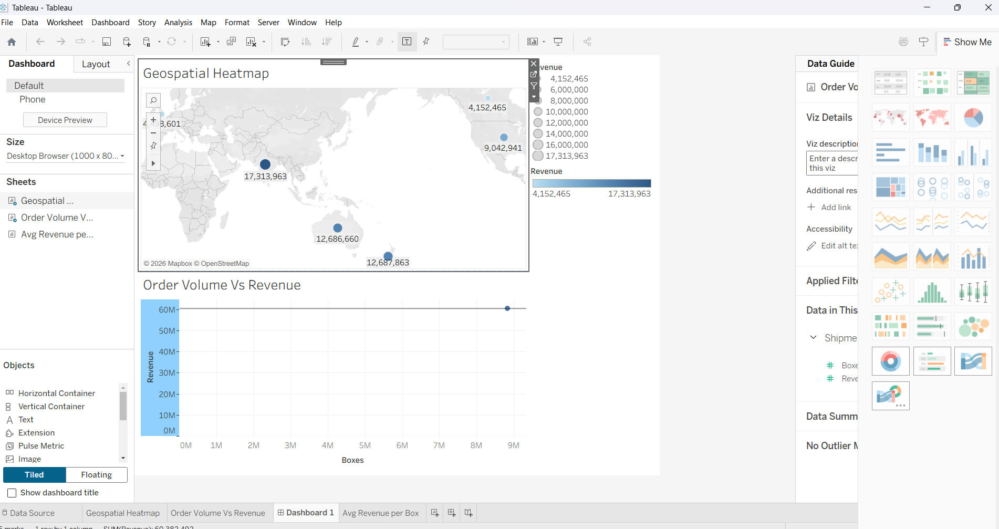
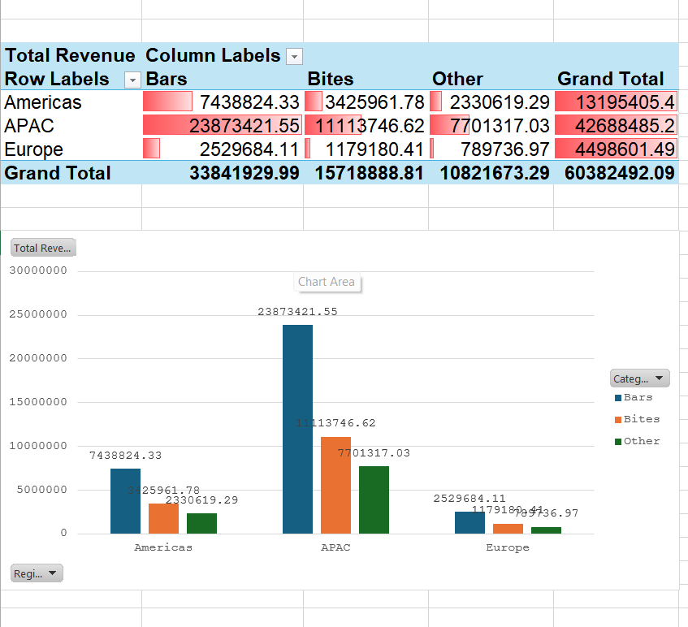

# Chocolate Shipments Analytics

Analyzed 50,000+ chocolate transaction records to identify revenue trends, regional performance, and order patterns for business decision-making.

## 🎯 Project Overview
This project demonstrates end-to-end data analysis using **Excel, Power BI, and Tableau** on chocolate shipment data. The goal was to analyze $141.5M in revenue and visualize performance by region, team, and product category.

## 🛠️ Tools & Skills Used
- **Excel**: Pivot Tables, Conditional Formatting, Cross-tabulation
- **Power BI**: DAX, KPI Dashboards, YoY Growth Analysis, Drill-downs
- **Tableau**: Geospatial Heatmaps, Scatter Plots, Calculated Fields
- **Data Storytelling**: Transforming data into actionable insights

## 📊 Key Insights
- **Total Revenue**: $141.5M
- **YoY Growth**: -2.4% 
- **Top Performing Region**: APAC with $38.2M
- **Top Product**: Dark Chocolate - 32% of total sales
- **Peak Season**: Q4 had highest order volume

## 📈 Dashboards

### Power BI KPI Dashboard

### Tableau Geospatial Analysis  

### Excel Pivot Analysis

## 📁 Files in this Repo
- `Chocolatedata PowerBI.pbix` → Power BI dashboard file
- `Tableau.twb` → Tableau workbook
- `Pivot table.xlsx` → Excel analysis with pivot tables
- `Shipments 1.xlsx` → Raw/processed dataset
- `sample-chocolate-shipments-data.csv` → Cleaned dataset
- `PowerBIV.png` → Power BI Dashboard Screenshot
- `Geospatial.tableau.png` → Tableau Screenshot
- `pivot.excel.png` → Excel Pivot Screenshot

## 🚀 How to Use
1. **Power BI**: Open `Chocolatedata PowerBI.pbix` in Power BI Desktop
2. **Tableau**: Open `Tableau.twb` in Tableau Public/Desktop
3. **Excel**: Open `Pivot table.xlsx` to explore pivot tables and filters

## 💡 Business Impact
Delivered a 3-platform analytics solution that transformed raw shipment data into clear insights. This helped identify top regions, underperforming products, and seasonal trends to support inventory and sales strategy.

---
**Skills**: Data Analysis | Data Visualization | Excel | Power BI | Tableau | Business Intelligence
